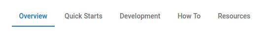
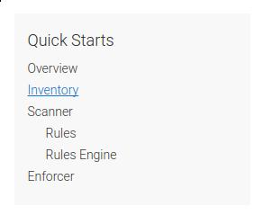

# Forseti Security

This branch (gh-pages) hosts the content used to build the
[forsetisecurity.org](http://forsetisecurity.org) website.

## License

See [LICENSE](https://github.com/GoogleCloudPlatform/forseti-security/blob/master/LICENSE)

### Third-party licenses

Third-party code and their respective licenses are in
[third_party/](https://github.com/GoogleCloudPlatform/forseti-security/tree/gh-pages/third_party).

## Contributing

See [CONTRIBUTING.md](https://github.com/GoogleCloudPlatform/forseti-security/blob/master/.github/CONTRIBUTING.md).

## Developing on forsetisecurity.org

### Understanding the *docs* collection

All documentation pages belong to a [collection](https://jekyllrb.com/docs/collections/).
This makes it easy to organize pages, access them programmatically, and
auto-generate navigation (both across and within documentation categories).

#### Documentation categories

There are a number of different documentation categories, e.g., "Guides",
"Quick Starts", "How Tos", etc. Each documentation page belongs to only one
category. These categories are used to control which tab the page appears under
on the Docs page.

[](#)

The order and destination of these category tabs is
defined in `_data/doc_categories.yml`. The tabs are defined by two properties:

- title: the name of the category
- href: the site-relative destination URL for the category

#### Adding a page to a category

The categories are inferred based upon the directory that a page is in.
For example, a page under `_docs/guides` belongs to the *Guides* category while
a page under `_docs/quickstarts` belongs to the *Quick Starts* category. 

Simply add your page to the appropriate directory.

The category is automatically assigned by the Jekyll configuration:

```yaml
defaults:
  ...
  - scope:
      path: _docs/quickstarts
    values:
      category: Quick Starts
  ...
```

You don't have to worry about explicitly declaring the page's category.

#### Controlling the order of a page in the category navigation sidebar

Any pages within a category are automatically added to the category navigation
sidebar, when a user is viewing that tab.

[](#)

The pages are sorted top-to-bottom using a custom `order`
[front-matter variable](https://jekyllrb.com/docs/frontmatter/). You can
control a page's order within the navigation sidebar by setting `order` to an
appropriate integer value.

Careful attention must be paid to nested pages.

#### Nested pages

Documentation pages can be nested by adding a new page to a category
sub-directory, e.g., `_docs/quickstarts/subdir/sub_page.md`. This will cause
your documentation page to be indented to the right.

You must be careful when ordering nested pages. As far as Jekyll is
concerned, the hierarchy is flat for a given category. If
`docs/quickstarts/top_page.md` has `order: 2` and
`_docs/quickstarts/subdir/sub_page.md` has `order: 1`, then `sub_page` will
appear **above** `top_page`.

#### Adding/updating categories

If you want to add or update a documentation category, then you must make sure
to update all three locations:

- `_data/doc_categories.yml`: add/update category name or location
- `_config.yml`: add/update category default for given directory
- `_docs/...`: add/update directory name

### Front-matter Conventions

#### On documentation pages

There are three panels on a documentation page:

[](#)

- Left Sidebar
- Main
- Right Sidebar

You are able to control the display of the left- and right-sidebar independently, using the front-matter:

```yaml
---
hide:
  left_sidebar: true
  right_sidebar: true
---
```

#### On FAQ pages

The order of an FAQ *within* its category is controlled by the `order` front-matter variable.

FAQs are sorted ascendingly within a category and rendered top-to-bottom.

### Customizing the Bootstrap Material Design Theme

The Material Design theme for Bootstrap is adapted from
[FezVrasta/bootstrap-material-design](https://github.com/FezVrasta/bootstrap-material-design)
(see its
[LICENSE in third_party/](https://github.com/GoogleCloudPlatform/forseti-security/blob/gh-pages/third_party/bootstrap-material-design/LICENSE.md)).

First, clone the repository. Next, follow the installation instructions in the
[README](https://github.com/FezVrasta/bootstrap-material-design/blob/master/README.md).
Now you can start customizing the LESS files under `less/`.

Once you're finished, build the CSS and JS files with:

```bash
$ grunt dist-less dist-js
``` 

And copy over everything under `dist/css/` and `dist/js/` into their
respective directories in this repository -- overwriting any old files in the
process.
