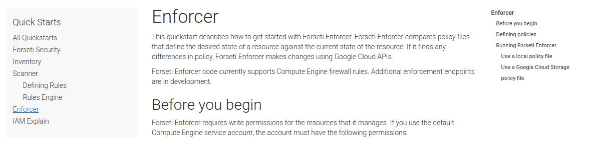

# Forseti Security

This branch (forsetisecurity.org) hosts the content used to build the
[forsetisecurity.org](http://forsetisecurity.org) website.

## License

See [LICENSE](https://github.com/GoogleCloudPlatform/forseti-security/blob/master/LICENSE)

### Third-party licenses

Third-party code and their respective licenses are in
[third_party/](https://github.com/GoogleCloudPlatform/forseti-security/tree/forsetisecurity.org/third_party).

## Contributing

See [CONTRIBUTING.md](https://github.com/GoogleCloudPlatform/forseti-security/blob/master/.github/CONTRIBUTING.md).

## Writing documentation on forsetisecurity.org

### Linking to versioned documentation

When linking to another page within the documentation, you can link to either the:

* latest version
* a specific version

To link to the latest version of a page, simply:

```

# OR

```

Both examples are valid. And for linking to a specific version, write out the version tag:

```

```

### Components

#### Zippies

Zippies are little collapsable accordion-like components that can be included throughout a page to hide information until a user clicks on it. For example:

**Closed Zippy**

[](#)

**Open Zippy** (after clicking "This is a test")

[](#)

The above is accomplished with the following Jekyll markdown:

```md

## A second heading

### A third heading

And some text here.



```

Zippies render Markdown properly.

A zippy accepts three parameters:

* title
* content
* UID (a unique ID)

The most important parameter is the UID; this ensures that zippies do not interfere with each other's open and close functionality. Therefore, each zippy on a page must be given a unique number to distinguish itself.

#### Responsive images

Responsive images allow us to optimize the display-size and memory-usage of images based upon the resolution of a user's screen. During build, we resize the image - from its largest resolution - down to a series of standard smaller resolutions. And then the browser is able to pick which size it wants to download based upon certain criteria.

To make any image responsive simply requires the use of a new `` liquid tag. For example:

```md

```

Produces the following:

[](#)

**Note:** Due to Jekyll idiosyncrasies, if you want to include a responsive image at a certain indentiation level, then you must pass an `indent` parameter to specify the level of indentation at which the template should be rendered.

As an example, say we are working with a nested list that's two indentation levels deep:

```md
* First level
  * Second level


```

This would put the image under the "Second level" bullet point by indenting it two indentation levels.

In addition, since responsive images can become a little bit unclear due to screen sizes or resizing, every image can be opened in a fullscreen lightbox by default:

[](#)

When a user clicks on a responsive image, a fullscreen lightbox is opened with the full resolution image.

## Developing on forsetisecurity.org

### Understanding the *docs* collection

All documentation pages belong to a [collection](https://jekyllrb.com/docs/collections/).
This makes it easy to organize pages, access them programmatically, and
auto-generate navigation (both across and within documentation categories).

#### Versioning

Documentation pages are separated into versioned directories as well, and -- in the case of *HEAD* -- the pages exist in the `_latest/` directory. All directories with a specific version are to be considered *frozen* in the sense that they are not expected to receive continual updates unless absolutely required.

The same document may exist between different versions or it may not. This document identity is determined by the filename (including directory). Renaming a document will break its identity between versions. For example: "Doc" will exist in v1 and v2 while "Renamed Doc" will only exist in v3 and there will be no connection between the documentation pages on the website.

In the case that a connection does exist, then it is determined by [build_doc_version_index.sh](scripts/build_doc_version_index.sh) which stores an inverted-index of documentation page to versions in `_data/doc_versions.yml`. This inverted index is used to create the per-page version dropdown seen below:

[](#)

##### Tombstone pages

And finally, for pages that existed in the past but no longer exist in the latest version of the documentation, a *tombstone* page is created. This allows graceful degradation of links across the Web to *latest* documentation.

Consider someone links to forsetisecurity.org/docs/**latest**/CoolModule on their blog. Over the course of a couple years, CoolModule is deprecated and then eventually removed from the software and the documentation.

An unsuspecting reader clicks the link above on our blogger’s site, and is promptly taken to a page for a module that no longer exists in the latest version.

We want to degrade gracefully.

So, the idea is that instead of 404’ing we will show a custom page that informs the user that the documentation does not exist in the latest version but it did exist in previous versions (with links to the documentation for those previous versions).

This tombstone page generation is handled by [generate_tombstone_files.sh](scripts/generate_tombstone_files.sh)

#### Documentation categories

> `_data/doc_categories.yml`, `scripts/data/version_config_defaults.yml` and `_config.yml` must be kept in-sync! When making changes, please ensure the others are updated accordingly.

There are a number of different documentation categories, e.g., "Guides",
"Quick Starts", "How Tos", etc. Each documentation page belongs to only one
category. These categories are used to control which tab the page appears under
on the Docs page.

[](#)

The order and destination of these category tabs is
defined in `_data/doc_categories.yml`. The tabs are defined by two properties:

- title: the name of the category
- href: the site-relative destination URL for the category

Categories are also versioned. The categories under a named version are not expected to be updated. Instead, the categories under `latest:` can be changed as needed. And then when a new version snapshot is created the `latest` categories will be snapshotted as well.

In the case that we have:

```yaml
latest:
- title: <example-title>
  href: <example-url>
v2.0:
- title: Concepts
  href: docs/$$VERSION$$/concepts/
- title: Setup
  href: docs/$$VERSION$$/setup/
- title: Configure
  href: docs/$$VERSION$$/configure/
- title: Use
  href: docs/$$VERSION$$/use/
- title: Develop
  href: docs/$$VERSION$$/develop/
- title: FAQ
  href: docs/$$VERSION$$/faq/
```

when a new version is generated for say `v2.1` it will become:

```yaml
latest:
- title: <example-title>
  href: <example-url>
v2.1:
- title: <example-title>
  href: <example-url>
v2.0:
- title: Concepts
  href: docs/$$VERSION$$/concepts/
- title: Setup
  href: docs/$$VERSION$$/setup/
- title: Configure
  href: docs/$$VERSION$$/configure/
- title: Use
  href: docs/$$VERSION$$/use/
- title: Develop
  href: docs/$$VERSION$$/develop/
- title: FAQ
  href: docs/$$VERSION$$/faq/
```

Furthermore, if the categories are changed then they must be updated in the `_config.yml` as well such that the defaults are set properly. When creating a new version, the `./scripts/create_new_version_from_latest.sh` pulls the version config defaults from `./scripts/data/version_config_defaults.yml` and adds them to `_config.yml`.

So in the example above, where the categories are modified in latest, they should also be modified in `./scripts/data/version_config_defaults.yml` to look like:

```yaml
  - scope:
      path: _docs/$$VERSION$$
    values:
      category: Overview ($$VERSION$$)
      layout: docs
  - scope:
      path: <example-url>
    values:
      category: <example-title> ($$VERSION$$)
```

This is as it was before. The `_config.yml` and `_data/doc_categories.yml` have to be kept in-sync for categories to work properly. There's no easy way to automate detection of new categories because the titles and url mappings have to be written by the documentation writers, or more specifically, whomever is responsible for the information architecture.

#### Adding a page to a category

The categories are inferred based upon the directory that a page is in.
For example, a page under `_docs/configure` belongs to the *Configure* category while
a page under `_docs/develop` belongs to the *Develop* category.

Simply add your page to the appropriate directory.

The category is automatically assigned by the Jekyll configuration:

```yaml
defaults:
  ...
  - scope:
      path: _docs/latest/configure
    values:
      category: Configure (latest)
  ...
```

You don't have to worry about explicitly declaring the page's category.

#### Controlling the order of a page in the category navigation sidebar

Any pages within a category are automatically added to the category navigation
sidebar, when a user is viewing that tab.

[](#)

The pages are sorted top-to-bottom using a custom `order`
[front-matter variable](https://jekyllrb.com/docs/frontmatter/). You can
control a page's order within the navigation sidebar by setting `order` to an
appropriate integer value.

Careful attention must be paid to nested pages.

#### Nested pages

Documentation pages can be nested by adding a new page to a category
sub-directory, e.g., `_docs/dir/subdir/sub_page.md`. This will cause
your documentation page to be indented to the right.

You must be careful when ordering nested pages. As far as Jekyll is
concerned, the hierarchy is flat for a given category. If
`docs/dir/top_page.md` has `order: 2` and
`_docs/dir/subdir/sub_page.md` has `order: 1`, then `sub_page` will
appear **above** `top_page`.

#### Adding/updating categories

If you want to add or update a documentation category, then you must make sure
to update all three locations:

- `_data/doc_categories.yml`: add/update category name or location
- `scripts/data/version_config_defaults.yml`: add/update category name or location
- `_config.yml`: add/update category default for given directory
- `_docs/...`: add/update directory name

### Front-matter Conventions

#### On documentation pages

There are three panels on a documentation page:

[](#)

- Left Sidebar
- Main
- Right Sidebar

You are able to control the display of the left- and right-sidebar independently, using the front-matter:

```yaml
---
hide:
  left_sidebar: true
  right_sidebar: true
---
```

#### On FAQ pages

The order of an FAQ *within* its category is controlled by the `order` front-matter variable.

FAQs are sorted ascendingly within a category and rendered top-to-bottom.

### Customizing the Bootstrap Material Design Theme

The Material Design theme for Bootstrap is adapted from
[FezVrasta/bootstrap-material-design](https://github.com/FezVrasta/bootstrap-material-design)
(see its
[LICENSE in third_party/](https://github.com/GoogleCloudPlatform/forseti-security/blob/forsetisecurity.org/third_party/bootstrap-material-design/LICENSE.md)).

First, clone the repository. Next, follow the installation instructions in the
[README](https://github.com/FezVrasta/bootstrap-material-design/blob/master/README.md).
Now you can start customizing the LESS files under `less/`.

Once you're finished, build the CSS and JS files with:

```bash
$ grunt dist-less dist-js
```

And copy over everything under `dist/css/` and `dist/js/` into their
respective directories in this repository -- overwriting any old files in the
process.

## Jekyll Customizations

### The build process

#### Generation of Python API documentation with Sphinx

Using [Sphinx](http://www.sphinx-doc.org/en/master/), we pull and process all Python docstrings straight from the source-code. These docstrings are expected to adhere to [Google's Python Docstrings format](http://sphinxcontrib-napoleon.readthedocs.io/en/latest/example_google.html).

We process and render all of this documentation down to a set of HTML files that are then inserted into the Jekyll website. This gives us:

* A **Module Index**

[](#)

* An **Index** of Entities

[](#)

* **Documentation Pages**

[](#)

* **Source Code Pages**

[](#)

All of these different pieces are available and linked together properly within the site.

We use Docker throughout this build process to both install the Forseti Security libraries and process the code. This reduces the amount of dependencies necessary on the host machine to *only* Docker. There's no need for Python, Sphinx, or anything else to be modified on the host machine.

More details can be found in [generate_sphinx_docs.sh](scripts/generate_sphinx_docs.sh).

### Plugins

#### Liquify filter

Liquify ([_plugins/third_party/liquify/](_plugins/third_party/liquify/)) is a third-party filter that provides functionality analogous to Jekyll's [markdownify filter](https://jekyllrb.com/docs/templates/).

By calling liquify, the liquid tags in a string can be processed from within another page. Allowing:

```
{{ content | liquify | markdownify }}
```

To be used on a file's contents before inserting into another page.

This is necessary due to an outstanding bug in Jekyll's internals: https://github.com/jekyll/jekyll/issues/6209. It has yet to be fixed; this plugin represents a workaround.

#### Exposing git commit information

The short-hash and datetime for the current commit is exposed by [git_commit_info.rb](_plugins/git_commit_info.rb) at `site.data['commit']['hash']` and `site.data['commit']['datetime']`, respectively. It's formatted as such:

```
hash: "ded28d2"
datetime: "2018-05-22 14:22"
```

Note that no timezone information is given with the datetime.

#### Excluding files from watch

Jekyll [watch](https://jekyllrb.com/docs/usage/) is useful when developing or writing documentation for the site. However, it doesn't play well with auto-generated pseudo-directories.

The [exclude_from_watch.rb](_plugins/exclude_from_watch.rb) plugin adds a new Jekyll configuration parameter called `exclude_from_watch` which can be set in the `_config.yml` similar to how `exclude` is. It allows a set of files/directories to be *included* in Jekyll's build but *excluded* from triggering a new build during Jekyll's continuous watch.

For example: when auto-generating the _docs/latest pseudo-directory, these new
files cause Jekyll's watch functionality to believe files have been modified
and trigger a new build. When triggering a new build, these files are auto-
generated again, which causes Jekyll's watch functionality to believe they've
been modified... and so on.

We break this cycle by including these files in the build, but excluding them
from triggering a new build on watch.

## Release Process

When releasing a new major version of Forseti Security's library, it's expected that a new version of the documentation will be created as well. This version of the documentation will be a snapshot of the *latest* version.

To create this new documentation version locally, you must:

1. Fully clone the forseti-security repository with tags
2. Run `./scripts/sync_latest_version.sh`
3. Create a new commit and push to forseti-security repository

All tags must be present locally for `./scripts/sync_latest_version.sh` to pickup the latest release version.

After this is done, a commit can be created and deployed as normal. The new release will exist under `_docs/vX.X/...`.
